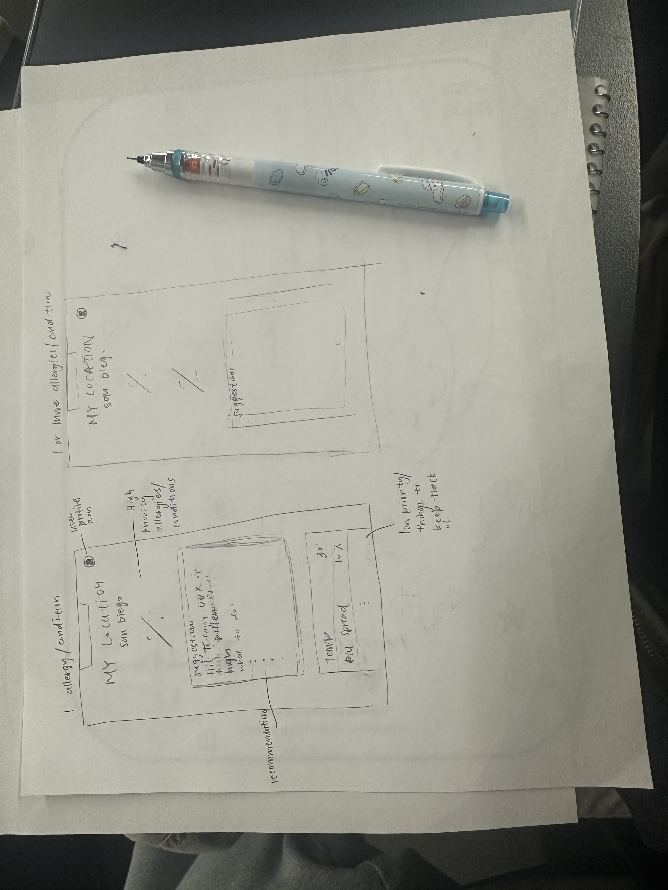

# Big Data Hackathon for San Diego 2024
<!-- ~~## OCT 12 (Day 1): Proposal Submission Guidelines~~ -->
## OCT 12 (Day 1): Proposal Submission Guidelines
> - Get a markdown template, [proposal_submission_form_2024.md](https://github.com/BigDataForSanDiego/bigdataforsandiego.github.io/blob/master/templates/proposal_submission_form_2024.md), which should be available in your GitHub team repository
> - Customize the template and rename it as README.md to replace the original README.md file **by 4:30 p.m.**

> - For a proposal, please provide us with the following:
>   - Your team name and members
>   - A title for your idea
>   - Hackathon theme it ties to (see list on site)
>   - A sentence describing your idea
>   - A visual that shows what your idea is (can be a sketch, photo, wireframe, etc.)
> - Make sure to think about the Hackathon theme, how this will help the user experience, how data will be incorporated and what problem it aims to solve. 

### 2024 BIG DATA HACKATHON PROPOSAL FORM

#### Team Number: 203

#### Team Name: Demure AI    
  
#### Your team’s hackathon idea in One sentence:
##### `User app that is trained on a user's health data and provides disease data based on region and provides precautionary guidelines.`

### User Story 
#### If I have a sun allergy, the app will notify you when UVs are extra intense.
#### If I have a pollen allergy the app will notify me when pollen count is high
#### If I have an auto-immune disease, the app will notify me if a cold or flu is spread around.
#### If I have Eczema, the app will notify me if air is dry, pollen, other triggers 

# We could extend this to pollution and health disparity data. 

#### A visual

 

<!--
#### Theme: Enhancing Healthcare’s Digital Front Door
#### - Digital solutions to help increase access, manage health, and improve patient satisfaction along the healthcare journey -  
-->

#### Hackathon Five CORE Themes. `CHECK ONE or TWO QUESTIONS (insert X in [ ])`.
- [ ] Access to care
> How can we make it easier to access care (especially specialists) and provide clear, timely notifications, and reminders along their healthcare journey?
- [X] Patient satisfaction
> How can we make it more convenient for patients to provide real-time feedback about their healthcare experience through a mobile app?
- [ ] New patient experience
> As a potential new customer, how can we leverage the mobile app to help new patients better understand what services are available to them?
- [X] Managing my health
> It’s easy to get overwhelmed by all the tasks patients often have to do to maintain their health, how can we make managing health more enjoyable?
- [ ] Addressing mental health challenges
> Mental health challenges may be difficult to identify and have a broad impact on health, how can we help clinicians be more in tune with patients mental health needs?

#### Optional Questions. `TEAMS CAN SELECT ONE ADDITIONAL OPTIONAL QUESTION (insert X in [ ])`
- [ ] Cultural Competence in Healthcare
> How can we design a mobile app that helps healthcare providers better understand and respect cultural differences, improving communication and care for diverse patient populations?
- [ ] Access to Care for Rural and Remote Communities
> How can we leverage technology to improve healthcare access for rural and remote communities, ensuring timely and specialized care for those in underserved areas? (Focus on SDSU Imperial Valley Connection - Rural/Remote)
- [X] Enhancing disease prevention (For Geocomputational Thinker Awards)
> How can big (geospatial) data analytics and AI be used to improve access to information about the influence of human behavior, cultural practices, and social interactions on the spread of diseases?
- [ ] Addressing environmental health disparities (For Geocomputational Thinker Awards)
> How can we leverage big (geospatial) data analytics and AI to improve access to resources that mitigate the impact of environmental factors, i.e. pollution, on health disparities?

#### Team Coordinator GitHub Username: `sgtran`

#### Team Members `Sean : sgtran`, 'Rachel: ', 'Sumay: SumayKalra', 'Spencer: '

<!-- ~~## OCT 19: Confirmation Form Submission~~ -->
<!--
## OCT 19: Confirmation Form Submission 
> - Complete a Google Form sent by the organizer to your registered email address
> - EACH TEAM must submit ONE FORM **by OCT 12, 11:59:59 p.m.** in order to be eligible to present your work on Saturday, Oct. 15.
-->
<!--
## OCT 19 (Day 2): Final Project Submission Guidelines
> - Submission Due: Upload **Presentation Slides** to the **top directory** of your team GitHub repository **by 9:55 a.m. (STRICT)** 
> - Upload any other materials (e.g., source codes, resources, images, demo video, sample data) to your team GitHub repository **by 9:55 a.m. (STRICT)** 
> - A Presentation slide template is available [here](https://github.com/BigDataForSanDiego/bigdataforsandiego.github.io/raw/master/templates/BigDataHackathon4SD_000.pptx). 
> - Rename the presentation template by replacing "000" with your team ID number.
> - Presentation Schedule is available [here](presentation_schedule.md). 
-->
