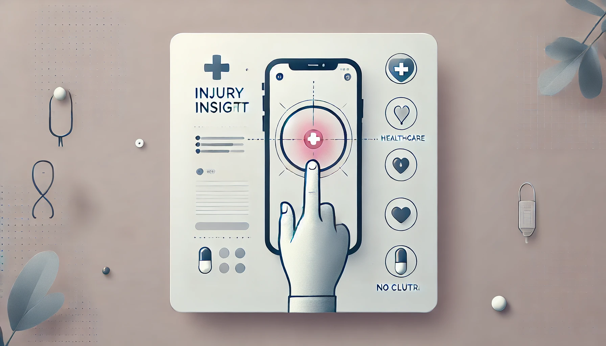

### 2024 BIG DATA HACKATHON PROPOSAL FORM

#### Team Number: `211`  

#### Team Name: Hack Noobies    

#### Your team’s hackathon idea in One sentence:
##### Our app classifies non-critical injuries or ailments using image and text input, providing treatment options, medicine recommendations, and delivery services, bridging the gap between self-diagnosis and professional medical advice.

#### A visual  

 

#### Hackathon Five CORE Themes. `CHECK ONE or TWO QUESTIONS (insert X in [ ])`.
- [ X ] Access to care
> How can we make it easier to access care (especially specialists) and provide clear, timely notifications, and reminders along their healthcare journey?
- [ ] Patient satisfaction
> How can we make it more convenient for patients to provide real-time feedback about their healthcare experience through a mobile app?
- [ ] New patient experience
> As a potential new customer, how can we leverage the mobile app to help new patients better understand what services are available to them?
- [ X ] Managing my health
> It’s easy to get overwhelmed by all the tasks patients often have to do to maintain their health, how can we make managing health more enjoyable?
- [ ] Addressing mental health challenges
> Mental health challenges may be difficult to identify and have a broad impact on health, how can we help clinicians be more in tune with patients mental health needs?

#### Optional Questions. `TEAMS CAN SELECT ONE ADDITIONAL OPTIONAL QUESTION (insert X in [ ])`
- [ ] Cultural Competence in Healthcare  
- [ X ] Access to Care for Rural and Remote Communities  
- [ ] Enhancing disease prevention (For Geocomputational Thinker Awards)  
- [ ] Addressing environmental health disparities (For Geocomputational Thinker Awards)  

#### Team Coordinator GitHub Username: `anandmysorekar`

#### Team Members
- Anand Mysorekar - `anandmysorekar`
- Nakshatra Bansal - `Nakshatra120`
- Ishaan Chadha - `ishaan1011`

